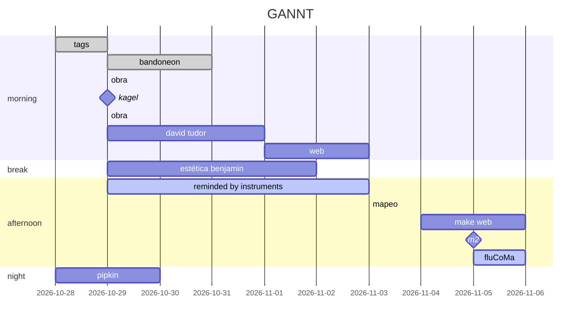

### Octubre
#### Objetivos
- Definir temática/s tentativa/s
	- Moduladores instrumentales externos
	- Similitud tímbrica entre moduladores humanos y artificiales
		- Posible estructura
			- capitulo 1 similitud
			- capitulo 2 timbre
			- capitulo 3 moduladores
			- capitulo 4 humanos
			- capitulo 5 artificiales
- Realizar análisis de la obra hasta el momento
- Cambios tentativos de la obra
Modo algo granular, de mosaico tímbrico, por eso es un posible tema, el timbre, podrias relacionarlo con la forma, que es el contenido en el que valverde hace hincapié, (forma tímbrica?, forma a partir del timbre?, ) o lo que ya hablamos de los moduladores, a eso sumar 1 (una sola, UNA no mas que una), herramienta novedosa de análisis, por ej  con flucoma podes analisar resultantes timbricas, teniendo los audios es facil y estas aportando al campo, es un contenido que podrias despues enseñar.
---
#### 1ra semana (10-10-2023)
###### Tareas
- [x] Completar anotaciones de la obra *Resonando*
- [ ] Lenguaje musical Messiaen
- [ ] investigar:
- [ ] ![[Pasted image 20231010225524.png]]
---
#### 2da semana (17-10-2023)

##### Investigación
- [x] Leer *Essays and Papers*
- [x] Leer *Music 2.0* (Assis)
- [x] Capítulo 1 - Curso Orpheus Institute in Ghent https://www.edx.org/learn/music-arts/ku-leuven-artistic-research-in-music-an-introduction
##### Temas posibles / intereses
- [x] Step 1-4 artistic research (*Essays and Papers*)
- [x] Leer *Software for artists book*
- [ ] Leer Estrategias de composición... timbre - Castro
- [x] Ver *Stiegler* ??
##### Otros / herramientas / ejercicios
- [x] Ver Latex
	- [x] LyX
	- [x] Overleaf
	- [x] Paaperia
- [x] Ver Zotero
- [x] Video+transcripción **actividad** Curso Orpheus Institute in Ghent
- [x] Análisis obra / obras / intereses personales
	- [ ] Análisis de *Resonando*
##### Obra
- [ ] Corregir audio: comienzo, intersección, + textura vib, perfil sección A (direccionalidad)
---
#### 3ra semana y 4ta semana (al 06-11-2023)

---
### Noviembre
---
##### Objetivos

- [ ] Reminded by the instruments
	- [ ] Open Sources: Words, Circuits, and the Notation/Realization Relation in the Music of David Tudor
	- [ ] Recital Hall of Cruelty: Antonin Artaud, David Tudor, and the 1950s Avant-Garde
	- [ ] The Buttons on Pandora’s Box: David Tudor and the Bandoneon
	- [ ] David Tudor and the Performance of American Experimental Music **(no lo encontré!)**
	- [ ] David Tudor’s Rainforest: An Evolving Exploration of Resonance
	- [ ] IDEA AND COMMUNITY: THE GROWTH OF DAVID TUDOR'S RAINFOREST, 1965-2006 - Matthew R. Rogalsky
- [ ] Espacio tímbrico - Wessel
- [ ] Estudios tímbricos - Riera
- [ ] Robotic musicianship - Gil Weinberg, Mason Bretan, Guy Hoffman, Scott Driscoll

1. Poder exponer el tema de tesis en 10/20 minutos ante quien corresponda y tener en cuenta las fuentes propuestas y las recomendadas posteriormente (consultar con una propuesta contundente aunque pueda ser modificable/enriquecida)
###### Decide if you're done
1. listar los tópicos (preguntas, facts) para la tesis
2. listar los tópicos que podrían soportar la hipótesis personal 
3. si se puede atribuir dos fuentes a cada uno de los tópicos del paso 1, y una buena fuente para la mayoría de los tópicos en paso 2, pasar al siguiente paso, de lo contrario, seguir en la búsqueda

https://www.getty.edu/research/tools/guides_bibliographies/david_tudor/resources.html (más biblio específica sobre Tudor)

---
