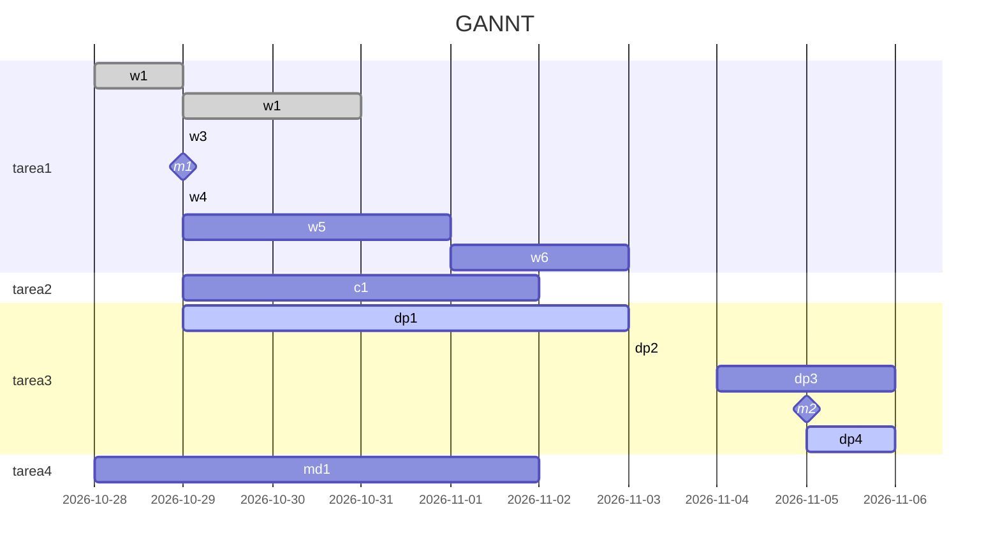

### Octubre
###### Objetivos
- Definir temática/s tentativa/s
	- Moduladores instrumentales externos
	- Similitud tímbrica entre moduladores humanos y artificiales
		- Posible estructura
			- capitulo 1 similitud
			- capitulo 2 timbre
			- capitulo 3 moduladores
			- capitulo 4 humanos
			- capitulo 5 artificiales
- Realizar análisis de la obra hasta el momento
- Cambios tentativos de la obra
Modo algo granular, de mosaico tímbrico, por eso es un posible tema, el timbre, podrias relacionarlo con la forma, que es el contenido en el que valverde hace hincapié, (forma tímbrica?, forma a partir del timbre?, ) o lo que ya hablamos de los moduladores, a eso sumar 1 (una sola, UNA no mas que una), herramienta novedosa de análisis, por ej  con flucoma podes analisar resultantes timbricas, teniendo los audios es facil y estas aportando al campo, es un contenido que podrias despues enseñar.
---
#### 1ra semana (10-10-2023)
###### Tareas
- [x] Completar anotaciones de la obra *Resonando*
- [ ] Lenguaje musical Messiaen
- [ ] investigar:
- [ ] ![[Pasted image 20231010225524.png]]
---
#### 2da semana (17-10-2023)

##### Investigación
- [x] Leer *Essays and Papers*
- [x] Leer *Music 2.0* (Assis)
- [x] Capítulo 1 - Curso Orpheus Institute in Ghent https://www.edx.org/learn/music-arts/ku-leuven-artistic-research-in-music-an-introduction
##### Temas posibles / intereses
- [x] Step 1-4 artistic research (*Essays and Papers*)
- [x] Leer *Software for artists book*
- [ ] Leer Estrategias de composición... timbre - Castro
- [ ] Ver *Stiegler* ??
##### Otros / herramientas / ejercicios
- [x] Ver Latex
	- [x] LyX
	- [x] Overleaf
	- [x] Paaperia
- [x] Ver Zotero
- [x] Video+transcripción **actividad** Curso Orpheus Institute in Ghent
- [x] Análisis obra / obras / intereses personales
	- [ ] Análisis de *Resonando*
##### Obra
- [ ] Corregir audio: comienzo, intersección, + textura vib, perfil sección A (direccionalidad)
---
#### 3ra semana (24-10-2023)

---
#### 4ta semana (31-10-2023 al 06-11-2023)
---
### Noviembre
---
#### 5ta semana (07-11-2023 al 13-11-2023)
---
#### 6ta semana (14-11-2023 al 20-11-2023)
---
#### 7ma semana (21-11-2023 al 22-11-2023)
